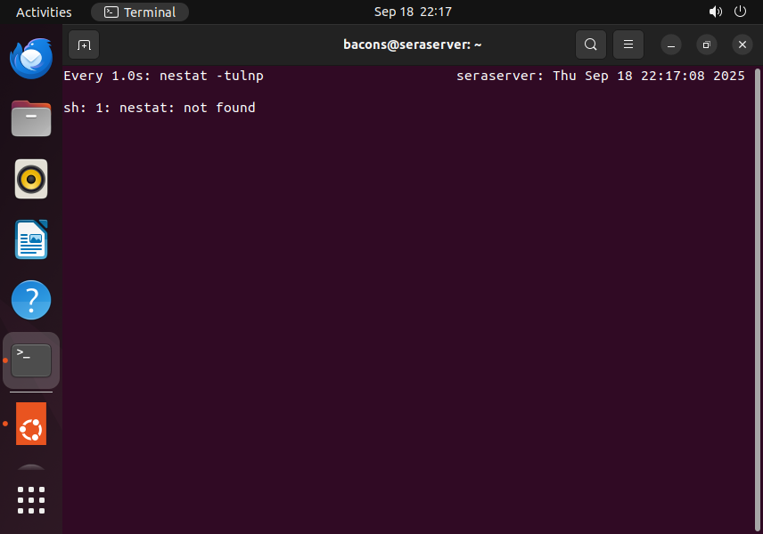
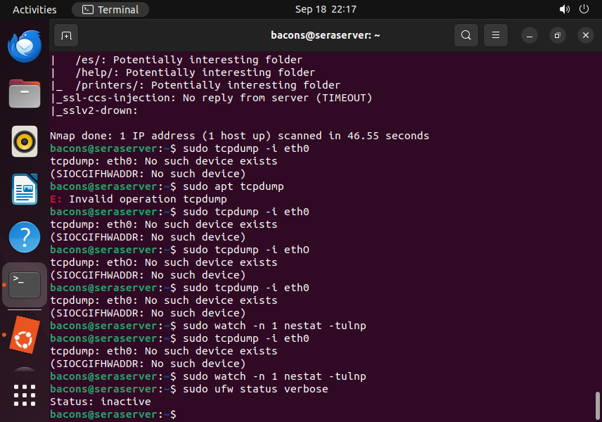

# Ubuntu Home Lab

1. Identify Network Interfaces and IP Addresses
  
This command shows all network connections and their IP addresses on the server. This is super helpful for setting a server up / finding any devices you might need to.

---

2. Check Open Ports
 
 
Lists all open ports, and the services that listen to those ports. Can be used to harden the server by removing unneeded ports. 
---

3. Analyze Network Connections
 
Lists all network connections

---

4. Preform Network Scanning with Nmap
 
Scans server to find running services, open ports, and can also discover services that are unintentionally exposed.

---

5. Check for Open Ports on the Server's Network
 
 
Identifies all live hosts on the local network. Allows users to make sure no unidentified connections are present. 

---

6. Check for Services and Versions
 
Scans for open ports, then identifies the services attached to those ports. Can identify vulnurable software. 

---

7. Identify Potential Vulnerabilities
 
Display known vulnarabilities on the server. used for finding security issues. 
---

8. Inspect Network Traffic
 
Shows all network traffic on a specific interface. 
---

9. Monitor network Connections in Real-Time
 
Continously watch network connections. Real time observations. 
---

10. Check Firewall Status
 
Displays firewall rules